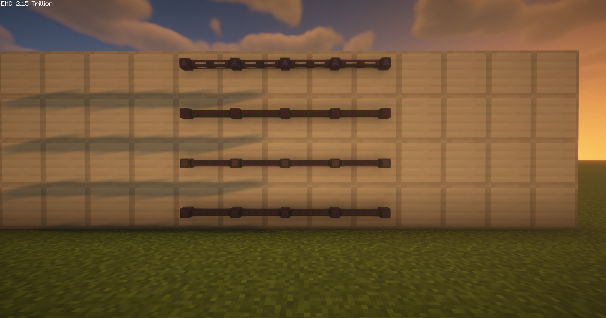

<p align="center">
  
</p>

# <p align="center">Ultimate Conduits</p>

<p align="center">
  <strong>EnderIO Add-on — Ultimate Tier Conduits with Max Transfer Rates</strong>
</p>

<p align="center">
  
  
  
  
</p>

<p align="center">
  
</p>

[日本語](#japanese) | [English](#english)

---

<a id="japanese"></a>
## 🇯🇵 日本語 (Japanese)

**EnderIO** にアルティメットティアのコンジットを追加するNeoForge Modです。全コンジットの転送レートが `Integer.MAX_VALUE`（2,147,483,647）に設定されており、事実上無制限の転送が可能です。

### 📦 依存Mod
| Mod | バージョン | 必須 |
|-----|-----------|------|
| [EnderIO](https://modrinth.com/mod/enderio) | 8.0.0+ | ✅ |
| [Mekanism](https://modrinth.com/mod/mekanism) | 10.7.0+ | ❌ (Chemical Conduitのみ) |

### ✨ 追加コンジット

| コンジット | 転送レート | 説明 |
|-----------|-----------|------|
| ⚡ Ultimate Energy Conduit | 2,147,483,647 FE/t | 最上位エネルギーコンジット |
| 💧 Ultimate Fluid Conduit | 2,147,483,647 mB/t | マルチフルイド対応、優先度設定可能 |
| 📦 Ultimate Item Conduit | 2,147,483,647 items/op | 最上位アイテムコンジット |
| 🧪 Ultimate Chemical Conduit | 2,147,483,647 mB/t | Mekanism連携、マルチケミカル対応 |

### 🔧 ビルド方法

```bash
gradlew.bat build
```

出力: `build/libs/ultimateconduits-1.0.0.jar`

---

<a id="english"></a>
## 🇺🇸 English

A NeoForge add-on mod for **EnderIO** that adds ultimate tier conduits. All conduits have a transfer rate of `Integer.MAX_VALUE` (2,147,483,647), enabling virtually unlimited transfer.

### 📦 Dependencies
| Mod | Version | Required |
|-----|---------|----------|
| [EnderIO](https://modrinth.com/mod/enderio) | 8.0.0+ | ✅ |
| [Mekanism](https://modrinth.com/mod/mekanism) | 10.7.0+ | ❌ (Chemical Conduit only) |

### ✨ Added Conduits

| Conduit | Transfer Rate | Description |
|---------|--------------|-------------|
| ⚡ Ultimate Energy Conduit | 2,147,483,647 FE/t | Top-tier energy conduit |
| 💧 Ultimate Fluid Conduit | 2,147,483,647 mB/t | Multi-fluid support, priority configurable |
| 📦 Ultimate Item Conduit | 2,147,483,647 items/op | Top-tier item conduit |
| 🧪 Ultimate Chemical Conduit | 2,147,483,647 mB/t | Mekanism integration, multi-chemical support |

### 🔧 Build

```bash
gradlew.bat build
```

Output: `build/libs/ultimateconduits-1.0.0.jar`

---

### 🛠 Technology Stack / 技術スタック
- **Platform**: [NeoForge](https://neoforged.net/) 21.1.77+ (Minecraft 1.21.1)
- **Base Mod**: [EnderIO](https://modrinth.com/mod/enderio) 8.0.0+ Conduit API
- **Optional**: [Mekanism](https://modrinth.com/mod/mekanism) 10.7.0+ Chemical Integration

### 📄 License / ライセンス
[MIT License](LICENSE)
